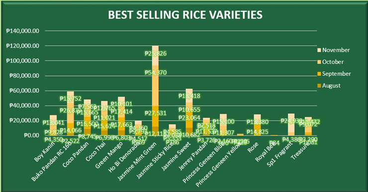
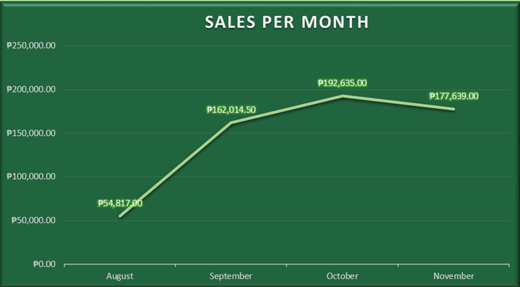
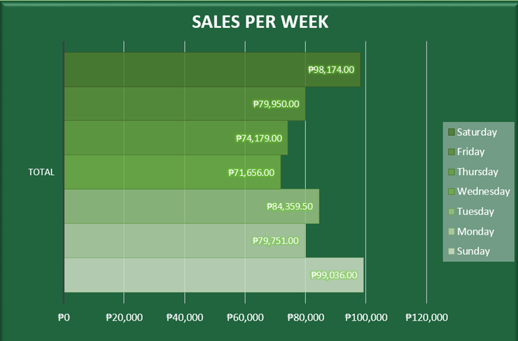
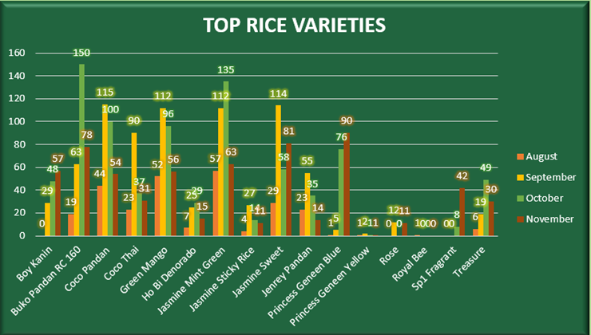
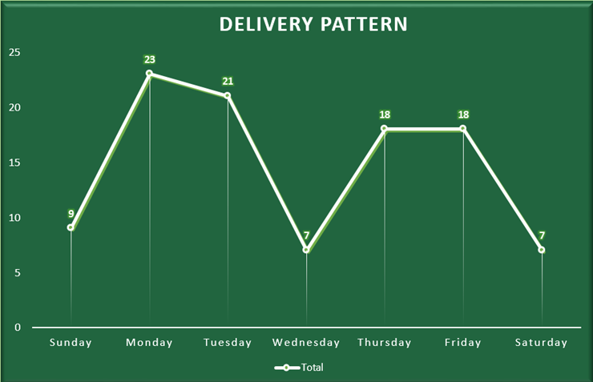
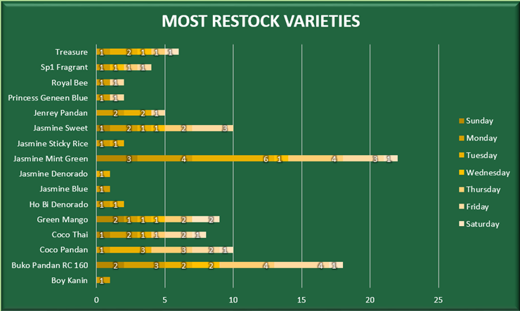
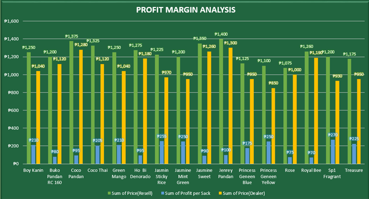
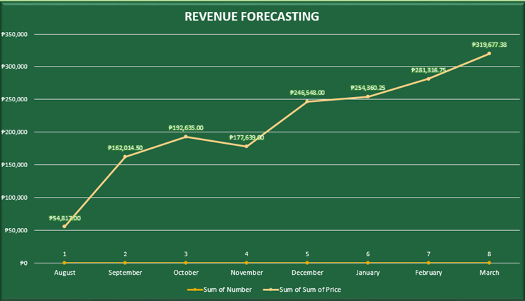

# Osang's Rice Business Inventory Management Analytics

**Supervising Inventory Management for Osang's Rice Business through Comprehensive Analytics**

A descriptive and predictive analytics project that transforms Osang's Rice Business operational records into actionable business insights through data preprocessing, forecasting, and interactive dashboards. The system enables business owners to monitor sales, inventory, restocking patterns, profit margins, and forecast future demand to support data-driven inventory management and decision-making.

---

## Problem Statement

Osang's Rice Business relies on manual inventory and sales recording, making it difficult to accurately monitor stock levels and forecast demand. A comprehensive analytics dashboard with inventory forecasting is needed to optimize restocking, reduce stock shortages, and support data-driven business decisions.

---

# Data

### Description

The dataset consists of daily operational records collected from Osang's Rice Business covering four months of business transactions.

The data includes:

- Rice varieties
- Selling price
- Dealer price
- Profit per sack
- Quantity sold
- Sales transactions
- Procurement records
- Delivery schedules
- Restocking frequency
- Daily receipts
- Monthly sales

These datasets were transformed into analytical tables used for forecasting, dashboard visualization, and business intelligence.

### Range Covered

**August 20, 2024 – November 25, 2024**

- Historical Sales Data
- Inventory Records
- Procurement Records
- Daily Receipts
- Forecasted Sales (Next 4 Months)

- **Rows:** 2518
- **Columns:** 7
### Data Processing

The project includes:

- Raw Data Collection
- Data Cleaning
- Data Transformation
- Data Integration
- Data Reduction
- Forecasting Dataset
- Pivot Tables
- Dashboard Visualization

---

# Methodology

## Data Preprocessing

The dataset underwent several preprocessing stages before analysis.

### Data Cleaning

- Removed duplicate records
- Corrected inconsistent entries
- Organized daily transaction records
- Improved data reliability for analysis

### Data Transformation

- Converted dates into Month and Week formats
- Generated additional analytical columns
- Standardized transaction records

### Data Integration

- Combined monthly datasets into a single dataset
- Prepared data for pivot tables and dashboards

### Data Reduction

- Extracted only relevant business variables
- Removed unnecessary information to improve reporting efficiency

---

## Predictive Analytics

Sales forecasting was performed using Excel's built-in forecasting model:

- **FORECAST.LINEAR()**

The model predicts possible sales revenue for the next four consecutive months based on historical sales data from August to November 2024.

---

## Development Tools

| Layer | Technology |
|--------|------------|
| Data Processing | Microsoft Excel |
| Data Cleaning | Excel |
| Forecasting | FORECAST.LINEAR() |
| Dashboard | Pivot Tables & Pivot Charts |
| Data Visualization | Microsoft Excel Charts |

---

# Dashboard Insights

## 1. Best-Selling Rice Variety

- Jasmine Mint Green generated the highest sales among all rice varieties.
- High demand indicates the need for frequent restocking.

---

## 2. Highest Monthly Sales

- October recorded the highest sales volume.
- Sales increased due to seasonal demand approaching the holiday season.

---

## 3. Highest Sales by Day

- Sunday generated the highest sales revenue.
- Weekend shopping behavior contributed to increased customer purchases.

---

## 4. Most Restocked Rice Variety

- Buko Panda RC60 was the most frequently restocked variety.
- Frequent replenishment reflects consistently high customer demand.

---

## 5. Monthly Restocking Pattern

- Monday recorded the highest delivery frequency.
- Beginning-of-week deliveries help maintain sufficient inventory levels.
---

## 6. Delivery Schedule Analysis

- Jasmine Mint Green remained the most replenished variety throughout the study period.
- Consistent restocking supports stable inventory availability.

---

## 7. Profit Margin Analysis

- Jenrey Pandan had the highest selling price per sack.
- SP1 Fragrant generated the highest profit margin among all rice varieties.

---

## 8. Sales Forecast

- Forecast results indicate continued sales growth over the next four months.
- Historical sales trends provide a basis for planning future inventory requirements.

---

# Key Business Benefits

The analytics dashboard helps stakeholders:

- Monitor sales performance
- Identify best-selling rice varieties
- Track inventory movement
- Optimize restocking schedules
- Forecast future sales
- Improve procurement planning
- Increase operational efficiency
- Support data-driven decision-making

---

# Potential Users

- Business Owner
- Inventory Manager
- Sales Personnel
- Supply Chain Dealers
- Business Analysts

---

# Recommendations

- Implement a computerized inventory management system for real-time monitoring.
- Collect longer historical datasets to improve forecasting accuracy.
- Integrate barcode or POS systems to automate transaction recording.
- Expand predictive models using Python or Power BI for more advanced analytics.
- Regularly monitor sales and inventory trends to minimize stock shortages and overstocking.

---

# Authors

- Bello, Jem Creydel
- Camua, Anthony Jade DR.
- De Jesus, Marco Angelo C.
- Dela Peña, Edrian C.
- Sison, Len Nathaniel

**Instructor:** Dr. Rosemarie M. Bautista

**Course:** IT 307 – Fundamentals of Enterprise Data Management

**Institution:** College of Information and Communications Technology, Bulacan State University

**Date:** December 2024
